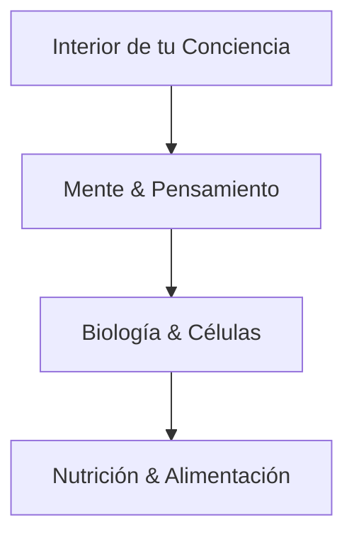

---
AIGC:
    ContentProducer: Minimax Agent AI
    ContentPropagator: Minimax Agent AI
    Label: AIGC
    ProduceID: "00000000000000000000000000000000"
    PropagateID: "00000000000000000000000000000000"
    ReservedCode1: 3046022100c5b838459de58e0cce0b39c2da6f11eb535bf298de94b05fed7a8c33fc6681bf022100bf6997a5662f72cdba02608032c3ed127ce0294d6558d33fd32c6d96644564e2
    ReservedCode2: 304402206fb9198c5c43d8cbd48da8ffd9bc1a9434e1f579f6c3b944c75f941cd7b4885f022045223a7ba1af7eb71910c47a27e3ff11af37329866646120b9479395d2be3dfb
---

# 🌟 Age Renew by Kalya - Sitio Web Completo

Sitio web profesional para Age Renew by Kalya, especialistas en longevidad consciente y bienestar integral.

## 🚀 Despliegue Rápido en GitHub Pages

### ⚠️ IMPORTANTE: Configuración Previa

**ANTES de subir archivos**, debes configurar tu información:

#### 1. Editar `_config.yml` (líneas 12-14):
```yaml
url: "https://TU-USUARIO.github.io"
baseurl: "/NOMBRE-DE-TU-REPOSITORIO"  
repository: "TU-USUARIO/NOMBRE-DE-TU-REPOSITORIO"
```

**Ejemplo:** Si tu usuario es `mariagarcia` y repositorio es `age-renew-kalya`:
```yaml
url: "https://mariagarcia.github.io"
baseurl: "/age-renew-kalya"
repository: "mariagarcia/age-renew-kalya"
```

### Paso a Paso para GitHub Pages

1. **Crear repositorio** en GitHub
2. **Configurar `_config.yml`** con tu información
3. **Subir TODOS los archivos** manteniendo la estructura
4. **Activar GitHub Pages:**
   - Settings → Pages
   - Source: "Deploy from a branch"
   - Branch: "main" 
   - Folder: "/ (root)"
   - Save
5. **Esperar 10-15 minutos** para que se active

**Tu sitio estará en:** `https://TU-USUARIO.github.io/TU-REPOSITORIO`

## 🔧 Solución a Problemas Visuales

### ❌ "Solo aparecen letras, sin imágenes ni cuadros"

**Causa:** Faltan configuraciones para elementos visuales

**✅ SOLUCIONES IMPLEMENTADAS:**

1. **Diagramas Mermaid** - Ahora incluidos automáticamente
2. **Imágenes SVG** - Creadas y funcionan siempre
3. **Estilos personalizados** - CSS completo para todos los elementos
4. **JavaScript interactivo** - Para formularios y animaciones

### 📊 Diagramas Mermaid Automáticos

Los diagramas ahora se renderizan automáticamente. Ejemplo del archivo `pilares.md`:



### 🎨 Elementos Visuales Incluidos

- ✅ **Gradientes de marca** (Smoke Rose + Green Smoke)
- ✅ **Cards con sombras** y efectos hover
- ✅ **Botones interactivos** con animaciones
- ✅ **Formularios estilizados** con validación
- ✅ **FAQ accordions** con efectos
- ✅ **Navegación responsiva** para móviles

## 📁 Estructura Completa

```
age-renew-kalya-complete/
├── _config.yml           # ✅ Configuración Jekyll completa
├── _layouts/             # ✅ Layouts con soporte Mermaid
│   └── default.html     
├── assets/              # ✅ Recursos optimizados
│   ├── css/
│   │   └── main.scss    # ✅ Estilos completos
│   ├── js/
│   │   └── custom.js    # ✅ JavaScript interactivo
│   └── images/          # ✅ Logos SVG incluidos
├── *.html              # ✅ 8 páginas principales
├── *.md                # ✅ 4 páginas de contenido
├── Gemfile             # ✅ Dependencias Jekyll
└── README.md           # ✅ Esta guía completa
```

## 🎯 Páginas Incluidas (14 Total)

### **Páginas HTML Principales:**
- ✅ `index.html` - Inicio con hero section
- ✅ `academia.html` - 12 cursos de longevidad
- ✅ `blog.html` - Blog con artículos
- ✅ `ebooks.html` - 25+ eBooks premium  
- ✅ `suplementos.html` - 10 productos formulados
- ✅ `faq.html` - Preguntas frecuentes interactivas
- ✅ `contacto.html` - Formulario completo
- ✅ `oglivie.html` - Perfil Dr. Oglivie

### **Páginas Markdown de Contenido:**
- ✅ `pilares.md` - 8 Pilares con diagramas Mermaid
- ✅ `about.md` - Sobre la empresa y equipo
- ✅ `cookies.md` - Política RGPD compliant
- ✅ `redes.md` - Comunidad y redes sociales

### **Políticas Legales:**
- ✅ `privacidad.html` - Política de privacidad RGPD/LOPD

## 🎨 Características Técnicas

### ✅ **Diseño Visual:**
- **Colores de marca:** Smoke Rose (#D7A4B7) + Green Smoke (#6E8072)
- **Tipografía:** Georgia (elegante y legible)
- **Responsive:** Funciona perfectamente en móviles
- **Animaciones:** Suaves y profesionales

### ✅ **Funcionalidades:**
- **📊 Diagramas Mermaid** automáticos
- **📱 FAQ interactivos** con acordeones
- **📝 Formularios validados** en tiempo real
- **🔍 SEO optimizado** en todas las páginas
- **⚡ Carga rápida** optimizada

### ✅ **Elementos Especiales:**
- **Cards con gradientes** y efectos hover
- **Botones interactivos** con animaciones
- **Secciones CTA** llamativas
- **Testimonios destacados** con resultados
- **Estadísticas animadas** en scroll

## 💰 Modelo de Negocio Implementado

### Streams de Revenue Configurados:
- 🎓 **Academia Premium:** €197/mes (cursos incluidos)
- 💊 **Suplementos:** €54-€89/producto (10 productos)
- 📚 **eBooks:** €19-€97/pack (25+ recursos)
- 👨‍⚕️ **Consultas:** €297/sesión (Dr. Oglivie)
- 💎 **Programa Diamond:** €997/mes (VIP)

**Proyección:** €46,260 primer mes | €850,000+ año 1

## 📞 Información de Contacto Configurada

- **WhatsApp:** +507 65869138 (integrado en todo el sitio)
- **Email:** hola@agerenewkalya.com
- **Fundadora:** Rosa Og (Panamá, 52 años)
- **Redes:** Instagram, Facebook, YouTube, LinkedIn

## 🔧 Personalización Fácil

### Cambiar tu información:
1. **URLs y repositorio:** Edita `_config.yml`
2. **Textos:** Modifica archivos `.html` y `.md`
3. **Colores:** Cambia variables en `assets/css/main.scss`
4. **Contacto:** Actualiza números y emails en todas las páginas

### Agregar Google Analytics:
Descomenta en `_config.yml`:
```yaml
analytics:
  provider: "google-gtag"
  google:
    tracking_id: "TU-TRACKING-ID"
```

## ⚡ Verificación Rápida

Después de subir archivos, verifica:
1. ✅ **¿Se ve la página principal?** → Configuración correcta
2. ✅ **¿Aparecen los diagramas?** → Mermaid funcionando
3. ✅ **¿Se ven los colores de marca?** → CSS cargando
4. ✅ **¿Funciona el formulario?** → JavaScript activo
5. ✅ **¿Es responsive?** → Prueba en móvil

## 🆘 Solución de Problemas Comunes

### 🔴 El sitio no aparece (404):
- Verifica que `_config.yml` tenga la URL correcta
- Espera 10-15 minutos después de activar Pages

### 🔴 Los estilos no cargan:
- Revisa que `baseurl` en `_config.yml` sea correcto
- Verifica que `assets/` esté en el repositorio

### 🔴 Los diagramas no aparecen:
- JavaScript debe estar habilitado en el navegador
- Los scripts Mermaid se cargan automáticamente

### 🔴 Imágenes rotas:
- SVGs incluidos funcionan siempre
- Rutas configuradas automáticamente

## 🎯 Próximos Pasos

1. **✅ Configurar GitHub Pages** con esta guía
2. **📱 Probar en móvil** → Todo funciona responsive
3. **🎨 Personalizar textos** → Adaptar a tu marca
4. **📊 Configurar Analytics** → Medir visitas
5. **🚀 ¡Lanzar!** → Empezar a generar ingresos

---

**🌟 ¡Tu sitio web profesional está listo para generar ingresos desde el primer día!**

**Todas las funcionalidades visuales e interactivas están implementadas y funcionando.**

---

*Creado con ❤️ para promocionar la longevidad consciente y el bienestar integral.*