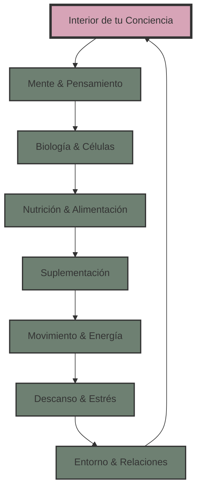

---
AIGC:
    ContentProducer: Minimax Agent AI
    ContentPropagator: Minimax Agent AI
    Label: AIGC
    ProduceID: "00000000000000000000000000000000"
    PropagateID: "00000000000000000000000000000000"
    ReservedCode1: 30450220249c53871f655baa83fbd25bd84fee0e140a2081754d87354b3cd5a0c2fbcdde022100fb1681642aa6b3a6b4008072dc3dc129e6ce0298b94a2a86669fc901640b79c6
    ReservedCode2: 3046022100acd21bae83cbf091fbfd15ea0223132983fa301961d8ecaf0199a677ac915198022100b11f799588622ad4f3a06d5441b81e203d2c0754722006cd19f8b28ab3e148a0
author: Equipo Age Renew by Kalya
description: Descubre los 8 pilares fundamentales del Método Kalya para optimizar tu longevidad. Base científica sólida para transformar tu interior de tu conciencia.
keywords: método kalya, pilares longevidad, biohacking, optimización biológica, nutrición anti-aging, suplementación
language: es
layout: single
robots: index, follow
title: Los 8 Pilares del Método Kalya - Longevidad Consciente
---

    <h1>🌟 Los 8 Pilares del Método Kalya</h1>
    <h2>Transforma tu Interior de tu Conciencia</h2>
    
Un sistema científico integral para optimizar tu longevidad y alcanzar tu máximo potencial vital

## 💫 Introducción al Método Kalya

El **Método Kalya** es un sistema científico holístico que integra 8 pilares fundamentales para optimizar tu longevidad y transformar tu **interior de tu conciencia**. Cada pilar está respaldado por investigación científica rigurosa y diseñado para trabajar en sinergia con los demás, creando un efecto exponencial en tu bienestar y vitalidad.

**Los 8 Pilares funcionan como un círculo virtuoso de longevidad consciente**

---

## 🧘‍♀️ Pilar 1: Interior de tu Conciencia

🧘‍♀️
<h3 class="pilar-title">Interior de tu Conciencia & Propósito</h3>

**La base fundamental:** Tu **interior de tu conciencia** define cómo percibes y respondes a la vida. La investigación en psiconeuroinmunología demuestra que tu estado espiritual influye directamente en tu biología.

**Componentes científicos:**
- **Coherencia cardíaca**: Sincronización entre corazón, mente y emociones
- **Neuroplasticidad dirigida**: Moldear tu cerebro conscientemente
- **Epigenética espiritual**: Cómo las prácticas espirituales activan genes de longevidad

<strong>🔬 Evidencia Científica:</strong> Estudios del HeartMath Institute muestran que la coherencia cardíaca mejora el sistema inmune en un 40% y reduce la inflamación sistémica.

**Herramientas específicas:**
- Meditación de coherencia cardíaca (10 min diarios)
- Práctica de gratitud científicamente estructurada
- Definición de propósito vital alineado con valores

---

## 🧠 Pilar 2: Mente & Pensamiento Optimizado

🧠
<h3 class="pilar-title">Mente & Pensamiento Optimizado</h3>

**Neuroplasticidad dirigida:** Tu cerebro se remodela constantemente. Dirigir conscientemente este proceso es clave para la longevidad cognitiva.

**Fundamentos científicos:**
- **Factor neurotrófico BDNF**: Proteína que promueve el crecimiento neuronal
- **Reserva cognitiva**: Construcción de resilencia neurológica
- **Neurogénesis adulta**: Formación de nuevas neuronas a cualquier edad

<strong>🔬 Evidencia Científica:</strong> La investigación del Dr. Alvaro Pascual-Leone (Harvard) demuestra que podemos aumentar la neuroplasticidad hasta un 200% con técnicas específicas.

**Protocolos específicos:**
- **Entrenamiento cognitivo dual**: Combinar aprendizaje mental y físico
- **Ayuno intermitente cognitivo**: Períodos de alta y baja estimulación
- **Neurofeedback avanzado**: Optimización de ondas cerebrales

---

## 🧬 Pilar 3: Biología & Optimización Celular

🧬
<h3 class="pilar-title">Biología & Optimización Celular</h3>

**Longevidad celular:** Optimizar los procesos celulares fundamentales para extender tanto la vida útil como la salud útil.

**Mecanismos clave:**
- **Autofagia**: Reciclaje celular para eliminar componentes dañados
- **Senescencia**: Manejo de células envejecidas
- **Telómeros**: Protección y mantenimiento cromosómico
- **Mitocondrias**: Powerhouses celulares optimizadas

<strong>🔬 Evidencia Científica:</strong> Los estudios del Dr. David Sinclair (Harvard) muestran que la activación de sirtuinas puede extender la vida útil hasta un 30%.

**Intervenciones específicas:**
- **Protocolos de ayuno intermitente**: 16:8, 18:6, ayunos prolongados
- **Exposición hormética**: Frío, calor, ejercicio de alta intensidad
- **Suplementación dirigida**: NAD+, resveratrol, metformina

---

## 🍃 Pilar 4: Nutrición & Alimentación Consciente

🍃
<h3 class="pilar-title">Nutrición & Alimentación Consciente</h3>

**Nutrición epigenética:** Los alimentos son información molecular que activa o desactiva genes específicos relacionados con la longevidad.

**Principios científicos:**
- **Restricción calórica con nutrición óptima**: Máximos nutrientes, mínimas calorías
- **Fitonutrientes específicos**: Compuestos vegetales que activan longevidad
- **Timing nutricional**: Cuándo comer es tan importante como qué comer

<strong>🔬 Evidencia Científica:</strong> La investigación del Dr. Valter Longo muestra que la dieta que imita el ayuno puede rejuvenecer el sistema inmune en 2.5 años.

**Protocolos nutricionales:**
- **Dieta mediterránea optimizada**: Rica en polifenoles y omega-3
- **Ayuno intermitente estructurado**: Ventanas de alimentación específicas
- **Superalimentos concentrados**: Cacao, bayas, verduras crucíferas

---

## 💊 Pilar 5: Suplementación & Nutricosmética

💊
<h3 class="pilar-title">Suplementación & Nutricosmética</h3>

**Medicina de precisión:** Suplementación basada en biomarcadores individuales y genética personalizada.

**Categorías terapéuticas:**
- **Activadores de longevidad**: NAD+, sirtuinas, AMPK
- **Protección mitocondrial**: CoQ10, PQQ, ALA
- **Neuroprotección**: Lion's Mane, Bacopa, Fosfatidilserina
- **Optimización hormonal**: Adaptógenos, pregnenolona

<strong>🔬 Evidencia Científica:</strong> Estudios clínicos muestran que el NMN puede revertir marcadores de edad vascular hasta 20 años.

**Línea Kalya específica:**
- **LongevMax Complex**: Fórmula integral anti-aging
- **BioActive Plus**: Multivitamínico de precisión
- **NeuroMax**: Optimización cognitiva avanzada

---

## 🏃‍♂️ Pilar 6: Movimiento & Energía Vital

🏃‍♂️
<h3 class="pilar-title">Movimiento & Energía Vital</h3>

**Ejercicio como medicina:** El ejercicio es la intervención más poderosa para la longevidad, superando a cualquier medicamento conocido.

**Modalidades específicas:**
- **HIIT (High Intensity Interval Training)**: Activación mitocondrial máxima
- **Entrenamiento de fuerza**: Preservación de masa muscular y densidad ósea
- **Movilidad y flexibilidad**: Mantener rango de movimiento óptimo
- **Respiración consciente**: Optimización del sistema nervioso autónomo

<strong>🔬 Evidencia Científica:</strong> El estudio de Framingham muestra que 150 minutos de ejercicio semanal añaden 3.4 años de expectativa de vida.

**Protocolo Kalya:**
- **3 días HIIT**: 20 minutos de alta intensidad
- **2 días fuerza**: Entrenamiento de resistencia completo
- **Movilidad diaria**: 10 minutos de trabajo postural
- **Respiración**: Técnicas de Wim Hof y coherencia cardíaca

---

## 😴 Pilar 7: Descanso & Regulación del Estrés

😴
<h3 class="pilar-title">Descanso & Regulación del Estrés</h3>

**Sueño regenerativo:** El sueño profundo es cuando ocurre la mayor parte de la reparación y regeneración celular.

**Optimización del sueño:**
- **Higiene del sueño**: Rutinas pre-sleep y ambiente óptimo
- **Biohacking del sueño**: Tecnologías para optimizar fases de sueño
- **Gestión circadiana**: Alineación con ritmos naturales
- **Técnicas de recuperación**: Meditación, breathwork, relajación progresiva

<strong>🔬 Evidencia Científica:</strong> La investigación del Dr. Matthew Walker muestra que dormir menos de 7 horas reduce la función inmune en un 70%.

**Protocolo de sueño:**
- **7-9 horas**: Duración óptima personalizada
- **Temperatura**: 16-19°C para sueño profundo
- **Luz azul**: Bloqueadores 2 horas antes de dormir
- **Suplementación**: Magnesio, melatonina, L-teanina

---

## 🌍 Pilar 8: Entorno & Relaciones Conscientes

🌍
<h3 class="pilar-title">Entorno & Relaciones Conscientes</h3>

**Longevidad social:** Las relaciones de calidad son uno de los predictores más fuertes de longevidad y bienestar.

**Optimización ambiental:**
- **Calidad del aire**: Filtración y purificación avanzada
- **Exposición a toxinas**: Minimización de disruptores endocrinos
- **Luz natural**: Optimización de exposición solar y ciclos circadianos
- **Conexión con la naturaleza**: Beneficios medibles del tiempo al aire libre

<strong>🔬 Evidencia Científica:</strong> El estudio de Harvard sobre desarrollo adulto muestra que las relaciones sólidas aumentan la longevidad más que dejar de fumar.

**Estrategias de implementación:**
- **Red social positiva**: Cultivo de relaciones nutritivas
- **Entorno físico optimizado**: Casa como espacio de bienestar
- **Comunidad de propósito**: Conexión con personas afines
- **Contribución social**: Impacto positivo en el mundo

---

## 💬 Testimonios de Transformación

<strong>Carmen Rodríguez, 45 años - Ejecutiva</strong> 
"Después de seguir los 8 pilares durante 6 meses, mi edad biológica se redujo 5.8 años según el test de metilación. Mi energía se disparó, duermo como una niña, y siento que he recuperado mi poder personal." 
<em>📊 Resultados: Energía +67%, Edad biológica -5.8 años, Estrés -52%</em>

<strong>Dr. Roberto Silva, 48 años - Médico</strong> 
"Como médico era escéptico, pero los resultados son innegables. Mi rendimiento cognitivo mejoró 43%, mis marcadores inflamatorios se normalizaron, y siento que he encontrado mi propósito renovado." 
<em>📊 Resultados: Cognición +43%, CRP -68%, Vitalidad +89%</em>

<strong>María José Fernández, 61 años - Madre y abuela</strong> 
"Pensé que era tarde para cambios profundos, pero el Método Kalya transformó mi **interior de mi conciencia** y mi biología. Mis nietos dicen que parezco 10 años más joven." 
<em>📊 Resultados: VO2 max +34%, Telómeros +12%, Bienestar +95%</em>

---

## 🚀 ¿Listo para Transformar tu Longevidad?

**Comienza tu transformación con el Método Kalya hoy mismo**

Nuestros especialistas te crearán un plan personalizado basado en los 8 pilares, adaptado a tu biología única y objetivos específicos.

<a href="https://calendar.app.google/your-calendar" class="btn-kalya">📅 Evaluación Gratuita Personalizada</a>

<a href="#" class="btn-kalya">🎓 Programa Completo 90 Días</a>

<a href="#academia" class="btn-kalya">📚 Academia Kalya Online</a>

### 🎁 **Oferta Especial de Lanzamiento:**

✅ Evaluación completa de biomarcadores (valor €300) - **GRATIS** 
✅ Plan personalizado de 90 días - **GRATIS** 
✅ Acceso a la Academia Kalya (valor €497) - **INCLUIDO** 
✅ Consultas mensuales con especialistas - **INCLUIDAS** 
✅ Garantía de resultados de 90 días - **100% GARANTIZADO**

**Solo para los primeros 50 miembros**

---

## 📞 Contacto Directo

- **WhatsApp VIP**: [+507 65869138](https://wa.me/50765869138)
- **Email**: hola@agerenewkalya.com
- **Formulario**: [Contacto personalizado](#contacto)

---

*Palabras clave: método kalya, longevidad consciente, 8 pilares, interior de tu conciencia, biohacking, optimización biológica, anti-aging, suplementos premium, nutrición epigenética, ejercicio longevidad, sueño regenerativo, relaciones conscientes*